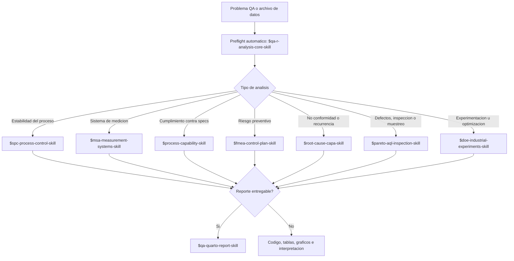
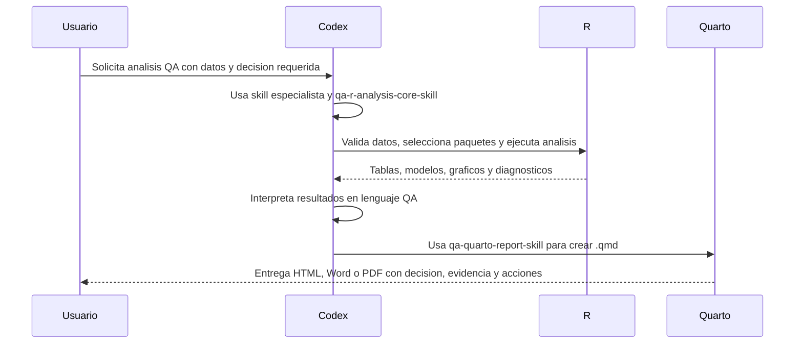

# QA Tools Skills For Codex

Skills para usar Codex como asistente tecnico en analisis de calidad con R.

El objetivo es que Codex no solo genere codigo, sino que ayude a estructurar el problema, validar datos, seleccionar metodos adecuados, ejecutar analisis reproducibles e interpretar resultados en lenguaje de calidad.

Este repo esta orientado a analisis como SPC, MSA, capacidad de proceso, FMEA, CAPA, Pareto, AQL y DOE, con foco en decisiones operativas, supuestos estadisticos y riesgos de interpretacion.

## Objetivo

Estas skills buscan reducir friccion en analisis tecnicos de calidad. Codex debe ayudar a:

- entender el problema QA y la decision requerida;
- validar datos, columnas, unidades, specs y estructura del archivo;
- seleccionar paquetes R adecuados, activos y defendibles;
- consultar documentacion oficial cuando el API, paquete o metodo pueda estar desactualizado;
- generar codigo R reproducible;
- generar reportes Quarto entregables cuando se solicite;
- interpretar resultados en lenguaje de calidad, operaciones y riesgo;
- declarar supuestos, limitaciones y acciones recomendadas.

La intencion no es automatizar criterio. Es crear un flujo de trabajo donde el analisis estadistico, la evidencia y la decision QA esten mejor conectados.

## Cuando Usar Este Repo

Usa estas skills cuando necesites analizar datos de calidad y convertirlos en una decision tecnica, por ejemplo:

- determinar si un proceso esta estable;
- evaluar si un sistema de medicion es adecuado para su uso previsto;
- calcular capacidad de proceso con advertencias correctas;
- priorizar defectos por frecuencia, costo, severidad o proveedor;
- estructurar una CAPA con evidencia y verificacion de efectividad;
- revisar un FMEA y convertir riesgos en controles accionables;
- definir, analizar o reportar un DOE industrial;
- generar un reporte tecnico en Quarto para documentar decision, evidencia y acciones.

## Skills Incluidas

| Skill | Uso principal |
| --- | --- |
| `qa-r-analysis-core-skill` | Flujo base, contrato de datos, seleccion de paquetes y checks de entorno R. |
| `qa-quarto-report-skill` | Reportes entregables en Quarto para HTML, PDF y Word. |
| `spc-process-control-skill` | Cartas de control, estabilidad, senales especiales y reaccion operativa. |
| `msa-measurement-systems-skill` | Gage R&R, atributos, sesgo, linealidad, estabilidad y riesgo de medicion. |
| `process-capability-skill` | Specs, estabilidad, normalidad, Cp, Cpk, Pp, Ppk, Cpm y PPM. |
| `fmea-control-plan-skill` | AMEF/FMEA, riesgos, controles, acciones y plan de control. |
| `root-cause-capa-skill` | 5 Why, Ishikawa, causa raiz, CAPA y verificacion de efectividad. |
| `pareto-aql-inspection-skill` | Pareto, AQL, muestreo, inspeccion, curvas OC y priorizacion. |
| `doe-industrial-experiments-skill` | DOE industrial: planificacion, diseno, modelo, analisis, RSM y confirmacion. |

## Comportamiento Esperado

No necesitas pedir en cada prompt que Codex verifique paquetes, busque documentacion actualizada, seleccione el metodo o prepare el plan. Eso es parte del preflight automatico de `qa-r-analysis-core-skill` y de las skills especialistas cuando hay datos, R o reporte involucrado.

Por defecto, las skills deben:

1. validar datos y columnas disponibles;
2. inferir el tipo de analisis QA;
3. revisar paquetes R instalados cuando haya ejecucion local;
4. verificar documentacion oficial si el paquete, funcion o metodo puede haber cambiado;
5. elegir el paquete o workflow R mas adecuado y un fallback;
6. preparar el plan de ejecucion antes del codigo final;
7. pedir solo informacion que bloquee el analisis;
8. separar evidencia estadistica, interpretacion tecnica y accion operativa.

## Mapa Rapido De Seleccion



## Flujo Analisis Mas Reporte



## Patron De Prompt Recomendado

```text
Usa $skill-name y, si aplica, $qa-quarto-report-skill.

Datos:
- Archivo:
- Columnas importantes:
- Specs, objetivo o criterio de aceptacion:
- Segmentos relevantes: linea, maquina, turno, lote, operador, proveedor:

Necesito:
- Decision QA:
- Graficos y tablas:
- Codigo R reproducible:
- Reporte Quarto: si/no; formato HTML, Word o PDF:

Restricciones:
- No instales paquetes sin aprobacion.
- Explica supuestos, riesgos y siguiente accion.
```

## Ejemplos Rapidos

### SPC

```text
Usa $spc-process-control-skill con datos/torque_final.csv.

Columnas: fecha_hora, linea, turno, lote, subgrupo, torque_nm.

Selecciona la carta correcta entre I-MR, Xbar-R o Xbar-S segun la estructura real. Evalua estabilidad, senales especiales, patrones por turno o lote y explica si los limites deben mantenerse, investigarse o recalcularse.

Genera codigo R reproducible y una interpretacion operativa.
```

Resultado esperado: carta seleccionada, limites de control, senales, estratificacion util, advertencia si hay mezcla de procesos y plan de reaccion.

### MSA

```text
Usa $msa-measurement-systems-skill con datos/msa_grr.csv.

Columnas: parte, operador, replica, medicion_mm.

El estudio es Gage R&R cruzado con 10 partes, 3 operadores y 3 replicas. La tolerancia total es 0.20 mm. Evalua repetibilidad, reproducibilidad, variacion parte-a-parte, interaccion parte-operador, %GRR, ndc y si el sistema sirve para decisiones de capacidad.
```

Resultado esperado: diagnostico del diseno MSA, resultados numericos, riesgos de medicion y decision de aceptabilidad para el uso previsto.

### Capacidad De Proceso

```text
Usa $process-capability-skill con datos/diametro_eje.csv.

Columnas: fecha_hora, maquina, cavidad, diametro_mm.
Specs: LSL 9.95, target 10.00, USL 10.05.

Primero verifica cumplimiento observado contra specs, luego estabilidad con carta apropiada, normalidad, posible mezcla por maquina/cavidad y finalmente Cp, Cpk, Pp, Ppk, Cpm y PPM.

Si no hay normalidad, propone alternativa y explica el riesgo.
```

Resultado esperado: decision capaz/no capaz, causa principal del riesgo, recomendacion de centrar, reducir variacion, estratificar o mejorar medicion.

### CAPA

```text
Usa $root-cause-capa-skill para la NC-2026-014: aumento de fugas en empaque desde el 2026-05-20.

Datos disponibles: defectos_por_lote.csv con lote, fecha, linea, turno, material, proveedor, defecto y cantidad.

Estructura contencion, 5 Why, Ishikawa, analisis de estratificacion, causa raiz verificada, accion correctiva, accion preventiva y criterio de efectividad.
```

Resultado esperado: narrativa CAPA completa, evidencia requerida para cada causa, acciones con responsables y prueba de efectividad.

### DOE

```text
Usa $doe-industrial-experiments-skill para planificar un DOE que reduzca humedad final.

Respuesta: humedad_pct.
Factores candidatos: temperatura 70-90 C, tiempo 20-40 min, velocidad 100-160 rpm, proveedor A/B.
Restricciones: temperatura y tiempo son costosos de cambiar; maximo 24 corridas.

Necesito detectar interacciones importantes y decidir si luego aplica superficie de respuesta. Entrega diseno recomendado, run table, aleatorizacion/bloqueo y codigo R.
```

Resultado esperado: plan experimental defendible, diseno seleccionado, supuestos, corridas, modelo propuesto y riesgos por restricciones.

### Reporte Quarto

```text
Usa $qa-quarto-report-skill para crear reports/capacidad_linea_1.qmd a partir de los resultados del analisis de capacidad.

Quiero salida HTML y Word, resumen ejecutivo al inicio, tabla de specs, Cp/Cpk/Pp/Ppk, PPM observado, normalidad, estabilidad, riesgos y acciones recomendadas.

Usa el template general y deja una seccion de reproducibilidad con sessionInfo().
```

Resultado esperado: `.qmd` listo para renderizar, CSS copiado, comandos `quarto render` y reporte con estructura ejecutiva.

## Principios De Uso

Estas skills deben reforzar criterio tecnico, no reemplazarlo. Algunas reglas de trabajo:

- No usar limites de especificacion como limites de control.
- No interpretar capacidad como conclusion robusta si el proceso no esta estable, salvo como analisis exploratorio declarado.
- No aceptar resultados estadisticos sin revisar el sistema de medicion cuando la decision dependa de mediciones.
- No proponer paquetes archivados o sin mantenimiento como primera opcion.
- No cerrar una CAPA sin evidencia de efectividad.
- No tratar un Pareto como causa raiz; solo prioriza investigacion.
- No usar AQL como prueba de capacidad de proceso.
- No ejecutar DOE sin definir respuesta, factores, niveles, restricciones y criterio de confirmacion.
- Separar evidencia estadistica, juicio operativo y decision documentada.

## Filosofia De Trabajo

Cada skill sigue el mismo patron:

1. Entender el caso y la decision.
2. Validar datos, specs, estructura y contexto.
3. Seleccionar metodo y paquete R con fuentes oficiales.
4. Ejecutar el analisis con codigo reproducible.
5. Generar reporte Quarto entregable si el usuario lo solicita.
6. Interpretar en lenguaje QA.
7. Recomendar accion operacional.

Las skills especialistas activan el preflight de `qa-r-analysis-core-skill` cuando el analisis requiera R, seleccion de paquetes, validacion de datos o reporte. No hace falta pedirlo de forma explicita.

## Paquetes R Iniciales

La seleccion final debe verificarse contra documentacion oficial cuando aplique. Candidatos comunes:

- SPC y capacidad: `qcc`, `SixSigma`.
- AQL y muestreo: `AcceptanceSampling`.
- DOE: `stats`, `DoE.base`, `FrF2`, `rsm`, `AlgDesign`, `skpr`.
- Visualizacion y datos: `ggplot2`, `dplyr`, `tidyr`, `readr`, `readxl`, `openxlsx`, `broom`, `gt`.
- Reportes: Quarto, `knitr`, `rmarkdown`.

No se debe usar `qualityTools` como default porque esta archivado en CRAN.

Fuentes utiles:

- <https://CRAN.R-project.org/package=qcc>
- <https://CRAN.R-project.org/package=SixSigma>
- <https://CRAN.R-project.org/package=AcceptanceSampling>
- <https://CRAN.R-project.org/view=ExperimentalDesign>

## Instalacion En Codex

Este repo contiene carpetas de skills completas. Para que Codex las descubra automaticamente, copia o sincroniza las carpetas de skills hacia tu directorio de skills, normalmente:

```text
%USERPROFILE%\.codex\skills
```

Tambien puedes mantenerlas en este repo para versionarlas y copiar solo las que quieras activar.

## Requisitos Generales

Para ejecutar los workflows de analisis y reporte se recomienda contar con:

- R instalado y disponible desde la terminal o entorno de trabajo;
- paquetes R necesarios para el analisis especifico;
- Quarto instalado cuando se requieran reportes `.qmd` renderizables;
- acceso a los archivos de datos y permisos de lectura/escritura en las carpetas de trabajo;
- conexion a internet cuando sea necesario consultar documentacion oficial o instalar paquetes aprobados.

Las versiones concretas de R, Quarto y paquetes deben verificarse en el ambiente donde se ejecute el analisis.

## Estructura

Cada skill incluye:

- `SKILL.md`: instrucciones principales y disparadores.
- `agents/openai.yaml`: metadata de interfaz.
- `references/`: guias de decision que se cargan solo cuando hacen falta.
- `scripts/`: plantillas R reutilizables.

## Politica De Paquetes

Las skills no deben instalar paquetes R sin aprobacion. Primero deben revisar si el paquete esta instalado, justificar por que se necesita y proponer la instalacion.

La skill base incluye:

```text
qa-r-analysis-core-skill/scripts/qa_r_package_check.R
```

para revisar paquetes comunes y versiones instaladas.

## Reportes Quarto

La skill `qa-quarto-report-skill` agrega una capa de entrega para convertir los analisis en documentos `.qmd` renderizables a HTML, Word o PDF. Incluye:

- templates en `qa-quarto-report-skill/assets/templates/`;
- CSS para HTML en `qa-quarto-report-skill/assets/styles/`;
- script de scaffolding en `qa-quarto-report-skill/scripts/create_qa_quarto_report.R`;
- guias de estructura de reportes en `qa-quarto-report-skill/references/`.

Comandos tipicos:

```powershell
quarto render report.qmd --to html
quarto render report.qmd --to docx
quarto render report.qmd --to pdf
```

## Estado Del Proyecto

Repositorio en desarrollo activo.

La prioridad actual es consolidar workflows reproducibles, criterios de seleccion de metodos, plantillas R y reportes Quarto para analisis QA. Las skills estan disenadas para evolucionar conforme se validen con casos de datos reales o simulados, especialmente en DOE, MSA y capacidad.

## Criterio Final

El valor de estas skills no esta en producir mas codigo.

Esta en ayudar a que el codigo, los datos y la interpretacion sostengan mejores decisiones de calidad.