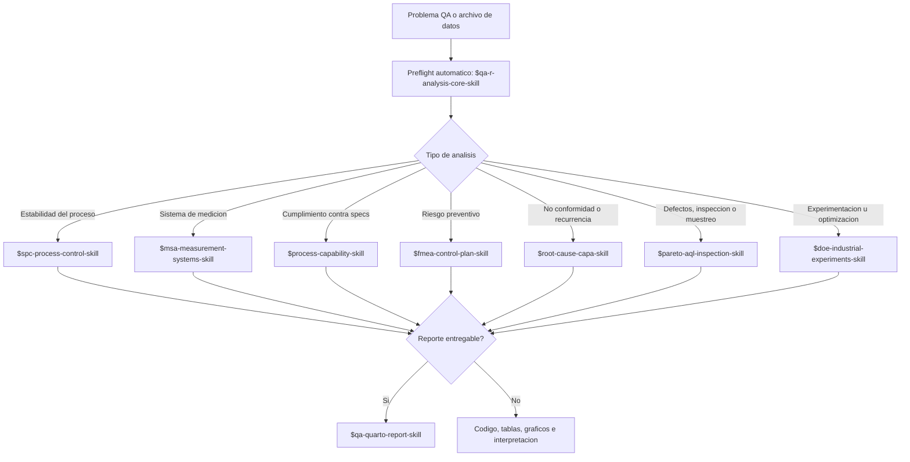
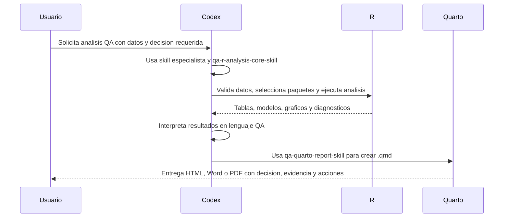

# QA Tools Skills For Codex

Paquete de skills para que Codex ayude a realizar analisis de calidad en R con criterio tecnico, seleccion actualizada de paquetes y salidas orientadas a decisiones QA.

## Objetivo

Estas skills evitan tener que buscar manualmente la documentacion cada vez que se necesita un analisis. Codex debe:

- entender el problema QA;
- validar los datos disponibles;
- seleccionar paquetes R adecuados y activos;
- consultar documentacion oficial cuando el API o la seleccion pueda estar desactualizada;
- generar codigo R reproducible;
- generar reportes Quarto entregables cuando se solicite;
- interpretar resultados en lenguaje de calidad;
- declarar supuestos, riesgos y acciones recomendadas.

## Skills Incluidas

| Skill | Uso principal |
| --- | --- |
| `qa-r-analysis-core-skill` | Flujo base, contrato de datos, seleccion de paquetes y checks de entorno R. |
| `qa-quarto-report-skill` | Reportes entregables en Quarto para HTML, PDF y Word. |
| `spc-process-control-skill` | Cartas de control, estabilidad, senales especiales y reaccion operativa. |
| `msa-measurement-systems-skill` | Gage R&R, atributos, sesgo, linealidad, estabilidad y riesgo de medicion. |
| `process-capability-skill` | Specs, estabilidad, normalidad, Cp, Cpk, Pp, Ppk, Cpm y PPM. |
| `fmea-control-plan-skill` | AMEF/FMEA, riesgos, controles, acciones y plan de control. |
| `root-cause-capa-skill` | 5 Why, Ishikawa, causa raiz, CAPA y verificacion de efectividad. |
| `pareto-aql-inspection-skill` | Pareto, AQL, muestreo, inspeccion, curvas OC y priorizacion. |
| `doe-industrial-experiments-skill` | DOE industrial completo: planificacion, diseno, modelo, analisis, RSM y confirmacion. |

## Ejemplos De Uso

Usa el nombre de la skill con `$skill-name` cuando quieras forzar una especialidad. Combina una skill analitica con `qa-quarto-report-skill` cuando necesites un entregable final.

### Comportamiento Automatico

No necesitas pedir en cada prompt que Codex verifique paquetes, busque documentacion
actualizada, seleccione el metodo o prepare el plan. Eso es parte del preflight
automatico de `qa-r-analysis-core-skill` y de las skills especialistas cuando hay
datos, R o reporte involucrado.

Por defecto, las skills deben:

1. validar datos y columnas disponibles;
2. inferir el tipo de analisis QA;
3. revisar paquetes R instalados cuando haya ejecucion local;
4. verificar documentacion oficial si el paquete, funcion o metodo puede haber cambiado;
5. elegir el paquete o workflow R mas adecuado y un fallback;
6. preparar el plan de ejecucion antes del codigo final;
7. pedir solo informacion que bloquee el analisis.

### Mapa Rapido De Seleccion



### Flujo Analisis Mas Reporte



### Patron De Prompt Recomendado

```text
Usa $skill-name y, si aplica, $qa-quarto-report-skill.

Datos:
- Archivo:
- Columnas importantes:
- Specs, objetivo o criterio de aceptacion:
- Segmentos relevantes: linea, maquina, turno, lote, operador, proveedor:

Necesito:
- Decision QA:
- Graficos y tablas:
- Codigo R reproducible:
- Reporte Quarto: si/no; formato HTML, Word o PDF:

Restricciones:
- No instales paquetes sin aprobacion.
- Explica supuestos, riesgos y siguiente accion.
```

### `qa-r-analysis-core-skill`

**Prompt 1**

> Usa `$qa-r-analysis-core-skill` con el archivo `datos/produccion.csv`.
>
> Necesito saber que analisis QA corresponde, que datos parecen listos o riesgosos,
> y cual seria el siguiente paso recomendado.

Resultado esperado: diagnostico de datos, metodo recomendado, paquetes sugeridos,
riesgos de los datos y primer script R reproducible.

**Prompt 2**

> Usa `$qa-r-analysis-core-skill` para preparar un analisis de capacidad no normal.
> Quiero la recomendacion del metodo, paquete R activo y fallback si el paquete
> preferido no esta instalado.
>
> No uses paquetes archivados como default.

Resultado esperado: seleccion razonada de paquetes, fuentes oficiales revisadas o
limitacion declarada, y ruta de implementacion.

### `qa-quarto-report-skill`

**Prompt 1**

> Usa `$qa-quarto-report-skill` para crear `reports/capacidad_linea_1.qmd`
> a partir de los resultados del analisis de capacidad.
>
> Quiero salida HTML y Word, resumen ejecutivo al inicio, tabla de specs,
> Cp/Cpk/Pp/Ppk, PPM observado, normalidad, estabilidad, riesgos y acciones
> recomendadas. Usa el template general y deja una seccion de reproducibilidad
> con `sessionInfo()`.

Resultado esperado: `.qmd` listo para renderizar, CSS copiado, comandos
`quarto render` y reporte con estructura ejecutiva.

**Prompt 2**

> Usa `$qa-quarto-report-skill` para generar un reporte ejecutivo de una pagina
> sobre una CAPA. Debe incluir decision, evidencia antes/despues, riesgo residual,
> responsable, fecha objetivo y criterio de efectividad.
>
> Entregalo como HTML autocontenido.

Resultado esperado: reporte breve para gerencia, sin sobrecargar con codigo ni salida
de consola.

### `spc-process-control-skill`

**Prompt 1**

> Usa `$spc-process-control-skill` con `datos/torque_final.csv`.
> Columnas: `fecha_hora`, `linea`, `turno`, `lote`, `subgrupo`, `torque_nm`.
>
> Selecciona la carta correcta entre I-MR, Xbar-R o Xbar-S segun la estructura real.
> Evalua estabilidad, senales especiales, patrones por turno o lote y explica si
> los limites deben mantenerse, investigarse o recalcularse.
>
> Genera codigo R reproducible y una interpretacion operativa.

Resultado esperado: carta seleccionada, limites de control, senales,
estratificacion util, advertencia si hay mezcla de procesos y plan de reaccion.

**Prompt 2**

> Usa `$spc-process-control-skill` y `$qa-quarto-report-skill` para crear un reporte
> de estabilidad de proceso. Incluye carta I-MR, resumen de puntos fuera de control,
> posible causa por fecha/lote, decision estable/inestable, recomendaciones de
> contencion y anexo con codigo R.

Resultado esperado: reporte Quarto con evidencia visual y decision de estabilidad.

### `msa-measurement-systems-skill`

**Prompt 1**

> Usa `$msa-measurement-systems-skill` con `datos/msa_grr.csv`.
> Columnas: `parte`, `operador`, `replica`, `medicion_mm`.
>
> El estudio es Gage R&R cruzado con 10 partes, 3 operadores y 3 replicas.
> La tolerancia total es 0.20 mm. Evalua repetibilidad, reproducibilidad,
> variacion parte-a-parte, interaccion parte-operador, %GRR, ndc y si el sistema
> sirve para decisiones de capacidad.

Resultado esperado: diagnostico del diseno MSA, resultados numericos, riesgos de
medicion y decision de aceptabilidad para el uso previsto.

**Prompt 2**

> Usa `$msa-measurement-systems-skill` con `datos/atributos_inspeccion.csv`.
> Columnas: `pieza`, `inspector`, `intento`, `resultado`, `estandar`.
>
> Evalua acuerdo intra-inspector, acuerdo entre inspectores, acuerdo contra estandar,
> kappa si aplica, falsos aceptados y falsos rechazados. Explica el riesgo para
> liberacion de producto.

Resultado esperado: matriz de acuerdo, indicadores de riesgo y recomendacion de
entrenamiento, criterio visual o mejora del sistema de inspeccion.

### `process-capability-skill`

**Prompt 1**

> Usa `$process-capability-skill` con `datos/diametro_eje.csv`.
> Columnas: `fecha_hora`, `maquina`, `cavidad`, `diametro_mm`.
>
> Specs: LSL 9.95, target 10.00, USL 10.05.
> Primero verifica cumplimiento observado contra specs, luego estabilidad con carta
> apropiada, normalidad, posible mezcla por maquina/cavidad y finalmente Cp, Cpk,
> Pp, Ppk, Cpm y PPM.
>
> Si no hay normalidad, propone alternativa y explica el riesgo.

Resultado esperado: decision capaz/no capaz, causa principal del riesgo,
recomendacion de centrar, reducir variacion, estratificar o mejorar medicion.

**Prompt 2**

> Usa `$process-capability-skill` y `$qa-quarto-report-skill` para entregar un
> reporte Quarto de capacidad en HTML y Word. El reporte debe iniciar con una
> decision ejecutiva, incluir histogramas, QQ plot, carta de estabilidad, tabla
> de indices e interpretacion de riesgos para cliente.

Resultado esperado: `.qmd` y artefactos renderizados con datos, graficos, indices
y acciones recomendadas.

### `fmea-control-plan-skill`

**Prompt 1**

> Usa `$fmea-control-plan-skill` con `pfmea_empaque.xlsx`.
> Revisa funcion, modo de falla, efecto, causa, controles preventivos, controles
> detectivos, severidad, ocurrencia y deteccion.
>
> Identifica cadenas logicas debiles, controles mal clasificados, riesgos altos
> sin accion, causas vagas como "error humano" y acciones sin evidencia.
> No inventes tablas de rating: usa las columnas existentes y pide el manual si falta.

Resultado esperado: lista priorizada de brechas, acciones recomendadas, riesgos que
requieren escalacion y supuestos de rating.

**Prompt 2**

> Usa `$fmea-control-plan-skill` para convertir los riesgos altos del AMEF en un
> plan de control. Para cada riesgo incluye caracteristica, especificacion, metodo
> de control, tamano de muestra, frecuencia, responsable, registro requerido y
> reaccion ante no conformidad.

Resultado esperado: tabla de plan de control lista para revision con produccion/calidad.

### `root-cause-capa-skill`

**Prompt 1**

> Usa `$root-cause-capa-skill` para la NC-2026-014: aumento de fugas en empaque
> desde el 2026-05-20. Datos disponibles: `defectos_por_lote.csv` con lote, fecha,
> linea, turno, material, proveedor, defecto y cantidad.
>
> Estructura contencion, 5 Why, Ishikawa, analisis de estratificacion, causa raiz
> verificada, accion correctiva, accion preventiva y criterio de efectividad.

Resultado esperado: narrativa CAPA completa, evidencia requerida para cada causa,
acciones con responsables y prueba de efectividad.

**Prompt 2**

> Usa `$root-cause-capa-skill` para analizar datos antes/despues de una accion
> correctiva. Columnas: `periodo`, `lote`, `defectos`, `unidades_inspeccionadas`.
>
> Evalua si la tasa de defectos bajo despues de la accion, si hay suficiente
> evidencia para cerrar CAPA y que monitoreo adicional recomiendas.

Resultado esperado: comparacion estadistica o grafica antes/despues, conclusion de
efectividad y riesgo residual.

### `pareto-aql-inspection-skill`

**Prompt 1**

> Usa `$pareto-aql-inspection-skill` con `datos/defectos_recibo.csv`.
> Columnas: `fecha`, `proveedor`, `lote`, `defecto`, `clase_defecto`,
> `cantidad`, `costo_estimado`.
>
> Crea Pareto por conteo, costo y clase de defecto. Estratifica por proveedor y
> recomienda los tres focos principales de mejora, aclarando si el Pareto sugiere
> prioridad pero no causa raiz.

Resultado esperado: tablas Pareto, graficos, prioridades por impacto y
recomendaciones de investigacion.

**Prompt 2**

> Usa `$pareto-aql-inspection-skill` para evaluar inspeccion AQL de lotes de
> 3,200 unidades, nivel general II, AQL 1.0 para defectos mayores y plan simple.
>
> Explica tamano de muestra, numero de aceptacion/rechazo, curva OC, riesgo de
> aceptar lotes malos y como documentar la decision de lote.

Resultado esperado: plan de muestreo, regla de decision, interpretacion de riesgo
productor/cliente y advertencia de que AQL no demuestra capacidad.

### `doe-industrial-experiments-skill`

**Prompt 1**

> Usa `$doe-industrial-experiments-skill` para planificar un DOE que reduzca
> humedad final. Respuesta: `humedad_pct`.
>
> Factores candidatos: temperatura 70-90 C, tiempo 20-40 min, velocidad
> 100-160 rpm, proveedor A/B. Restricciones: temperatura y tiempo son costosos
> de cambiar; maximo 24 corridas.
>
> Necesito detectar interacciones importantes y decidir si luego aplica superficie
> de respuesta. Entrega diseno recomendado, run table, aleatorizacion/bloqueo
> y codigo R.

Resultado esperado: plan experimental defendible, diseno seleccionado, supuestos,
corridas, modelo propuesto y riesgos por restricciones.

**Prompt 2**

> Usa `$doe-industrial-experiments-skill` y `$qa-quarto-report-skill` para analizar
> un DOE con modelo, interacciones, diagnosticos, superficie de respuesta y corridas
> de confirmacion.

Resultado esperado: analisis ANOVA/modelo, efectos principales, interacciones,
diagnosticos, RSM si aplica, configuracion recomendada y reporte Quarto.

## Filosofia De Uso

Cada skill sigue el mismo patron:

1. Entender el caso y la decision.
2. Validar datos, specs, estructura y contexto.
3. Seleccionar metodo y paquete R con fuentes oficiales.
4. Ejecutar el analisis con codigo reproducible.
5. Generar reporte Quarto entregable si el usuario lo solicita.
6. Interpretar en lenguaje QA.
7. Recomendar accion operacional.

Las skills especialistas activan el preflight de `qa-r-analysis-core-skill` cuando el analisis requiera R, seleccion de paquetes, validacion de datos o reporte. No hace falta pedirlo de forma explicita.

## Paquetes R Iniciales

La seleccion final debe verificarse contra documentacion oficial cuando aplique. Candidatos comunes:

- SPC y capacidad: `qcc`, `SixSigma`.
- AQL y muestreo: `AcceptanceSampling`.
- DOE: `stats`, `DoE.base`, `FrF2`, `rsm`, `AlgDesign`, `skpr`.
- Visualizacion y datos: `ggplot2`, `dplyr`, `tidyr`, `readr`, `readxl`, `openxlsx`, `broom`, `gt`.
- Reportes: Quarto, `knitr`, `rmarkdown`.

No se debe usar `qualityTools` como default porque esta archivado en CRAN.

Fuentes utiles:

- <https://CRAN.R-project.org/package=qcc>
- <https://CRAN.R-project.org/package=SixSigma>
- <https://CRAN.R-project.org/package=AcceptanceSampling>
- <https://CRAN.R-project.org/view=ExperimentalDesign>

## Instalacion En Codex

Este repo contiene carpetas de skills completas. Para que Codex las descubra automaticamente, copia o sincroniza las carpetas de skills hacia tu directorio de skills, normalmente:

```text
%USERPROFILE%\.codex\skills
```

Tambien puedes mantenerlas en este repo para versionarlas y copiar solo las que quieras activar.

## Estructura

Cada skill incluye:

- `SKILL.md`: instrucciones principales y disparadores.
- `agents/openai.yaml`: metadata de interfaz.
- `references/`: guias de decision que se cargan solo cuando hacen falta.
- `scripts/`: plantillas R reutilizables.

## Politica De Paquetes

Las skills no deben instalar paquetes R sin aprobacion. Primero deben revisar si el paquete esta instalado, justificar por que se necesita y proponer la instalacion.

La skill base incluye:

```text
qa-r-analysis-core-skill/scripts/qa_r_package_check.R
```

para revisar paquetes comunes y versiones instaladas.

## Reportes Quarto

La skill `qa-quarto-report-skill` agrega una capa de entrega para convertir los analisis en documentos `.qmd` renderizables a HTML, Word o PDF. Incluye:

- templates en `qa-quarto-report-skill/assets/templates/`;
- CSS para HTML en `qa-quarto-report-skill/assets/styles/`;
- script de scaffolding en `qa-quarto-report-skill/scripts/create_qa_quarto_report.R`;
- guias de estructura de reportes en `qa-quarto-report-skill/references/`.

Comandos tipicos:

```powershell
quarto render report.qmd --to html
quarto render report.qmd --to docx
quarto render report.qmd --to pdf
```

En esta maquina se encontro Quarto 1.9.37 y R 4.5.1. `Rscript.exe` esta instalado en:

```text
C:\Program Files\R\R-4.5.1\bin\Rscript.exe
```

## Estado

Primera version funcional del paquete de skills QA en R. Las skills estan disenadas para evolucionar con casos reales, especialmente DOE, MSA y capacidad.
